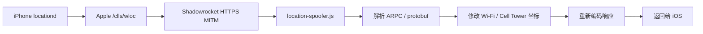
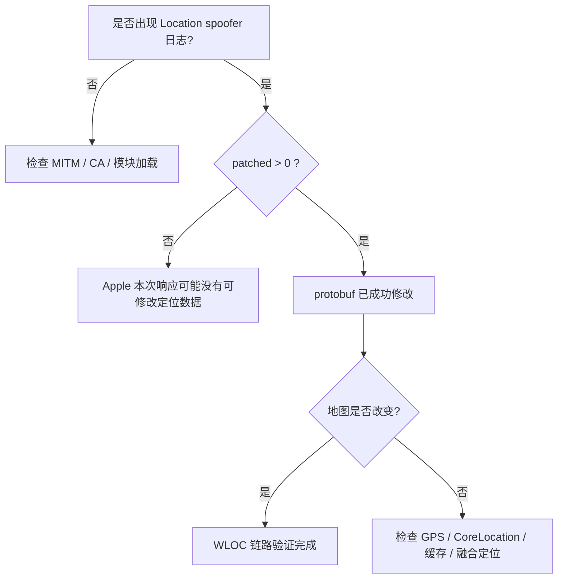

# Shadowrocket 修改 Apple WLOC 网络定位


> 基于 Shadowrocket HTTPS MITM，对 Apple WLOC（Wi‑Fi / 蜂窝网络定位）响应进行修改。
>
> 适用于：**网络定位研究、开发测试、定位链路调试**。

> [!IMPORTANT]
> 本项目修改的是 **Apple WLOC 网络定位**，不是 GPS / GNSS，也不是对 CoreLocation Framework 进行 Hook。
> 因此 Apple 地图出现目标位置，并不代表第三方 App 一定会采用相同位置。

## 30 秒了解

| 项目 | 说明 |
|---|---|
| 修改对象 | Apple WLOC Wi‑Fi / Cell Tower 定位响应 |
| 实现方式 | Shadowrocket HTTPS MITM + JavaScript response patch |
| 是否修改 GPS | ❌ |
| 是否修改 CoreLocation | ❌ |
| 已验证示例 | `22.285118, 114.159561` |
| 最重要的验证方式 | 查看 PacketTunnel 日志中的 `firstWifi` / `firstCell` |

## 快速开始

1. 在 Shadowrocket 开启 **HTTPS 解密** 与 **HTTP/2 中间人攻击**。
2. 安装并在 iOS 中 **完全信任 Shadowrocket CA**。
3. 导入本仓库的 Debug 模块并重新连接 Shadowrocket。
4. 打开 Apple 地图，同时检查 PacketTunnel 日志。

### 模块文件

| 文件 | 用途 |
|---|---|
| [`ios-location-spoofer-hk-debug.sgmodule`](./modules/ios-location-spoofer-hk-debug.sgmodule) | 已验证的香港坐标 Debug 示例 |
| [`ios-location-spoofer-template.txt`](./modules/ios-location-spoofer-template.txt) | 可复制后自行替换经纬度的模板 |

**Raw 配置：**

- [打开已验证 Debug 配置](https://raw.githubusercontent.com/lok347/shadowrocket-apple-wloc/main/modules/ios-location-spoofer-hk-debug.sgmodule)

> [!TIP]
> 首次测试建议保留 `debug=true`。确认成功后再改为 `debug=false`。

---

## 工作原理



Apple WLOC 返回的并不是普通 JSON，而是二进制协议。脚本主要做三件事：

1. 拦截 Apple WLOC 请求；
2. 解析 `/clls/wloc` 返回的 ARPC / protobuf；
3. 修改 Wi‑Fi 与蜂窝基站定位数据后重新封装响应。

<details>
<summary><strong>查看 protobuf 字段细节</strong></summary>

### Wi‑Fi

```text
AppleWLoc
└── field 2: wifi_devices
    └── field 2: location
```

### Cellular

```text
AppleWLoc
└── field 22 / 24: cell_tower_response
    └── field 5: location
```

位置字段：

| 字段 | 含义 |
|---|---|
| field 1 | latitude |
| field 2 | longitude |

坐标写入前按以下方式编码：

```text
coord × 100000000
```

脚本还会处理：

- `horizontalAccuracy`
- `verticalAccuracy`
- `altitude`
- `motionActivityType`
- `motionActivityConfidence`

</details>

---

## 环境准备

### 1. Shadowrocket 设置

开启：

- **HTTPS 解密**
- **HTTP/2 中间人攻击**

HTTP/2 建议开启，因为 Apple WLOC 请求可能通过 HTTP/2 传输。

### 2. 安装并完全信任 CA

Shadowrocket：

```text
HTTPS 解密
→ 证书
→ 生成 CA
→ 安装证书
```

然后进入 iOS：

```text
设置
→ 通用
→ VPN 与设备管理
→ 安装 Shadowrocket CA
```

安装后继续：

```text
设置
→ 通用
→ 关于本机
→ 证书信任设置
→ Shadowrocket CA
→ 完全信任
```

> [!WARNING]
> 仅“安装证书”还不够，必须在「证书信任设置」中开启完全信任。

---

## 已验证示例配置

示例坐标：

```text
Latitude:  22.285118
Longitude: 114.159561
```

核心参数：

```text
latitude=22.285118
longitude=114.159561
horizontalAccuracy=39
verticalAccuracy=1000
altitude=530
debug=true
```

完整配置请直接查看：

- [GitHub 文件页面](./modules/ios-location-spoofer-hk-debug.sgmodule)
- [Raw 纯文本](https://raw.githubusercontent.com/lok347/shadowrocket-apple-wloc/main/modules/ios-location-spoofer-hk-debug.sgmodule)

> [!TIP]
> 修改坐标时，建议先只改 `latitude` 和 `longitude`。先验证链路正常，再调整 accuracy、altitude 等参数。

---

## 正确启用顺序

配置本身正确，但没有重新建立 PacketTunnel 时，脚本也可能没有重新加载。

1. 关闭旧的 WLOC / `gs-loc` 模块
2. 开启 **HTTPS 解密**
3. 开启 **HTTP/2 MITM**
4. 确认 Shadowrocket CA 已完全信任
5. 启用 Location Spoofer 模块
6. 断开 Shadowrocket
7. 重新连接 Shadowrocket
8. 关闭 iOS 定位服务
9. 等待约 `5–10` 秒
10. 重新开启定位服务
11. 打开 Apple 地图
12. 查看 PacketTunnel 日志

> [!NOTE]
> 首次测试建议在室内进行。室内 GPS / GNSS 信号通常较弱，Wi‑Fi / Cell 网络定位更容易体现。

---

## 如何确认是否成功

不要只看地图。最重要的是查看 **Shadowrocket PacketTunnel 日志**。

建议搜索：

```text
Location spoofer
clls
gs-loc
bluedot
```

### Wi‑Fi 修改成功

```text
Location spoofer patched 400 wifi devices, 0 cell towers
Location spoofer patched locations:
firstWifi=22.28511800,114.15956100
```

| 环节 | 状态 |
|---|---|
| HTTPS MITM | ✅ |
| `/clls/wloc` 命中 | ✅ |
| Response 获取 | ✅ |
| protobuf 解析 | ✅ |
| Wi‑Fi 坐标修改 | ✅ |

### 蜂窝基站修改成功

```text
Location spoofer patched 0 wifi devices, 121 cell towers
Location spoofer patched locations:
firstCell=22.28511800,114.15956100
```

如果已经出现 `firstWifi=目标坐标` 或 `firstCell=目标坐标`，说明 protobuf 修改链路已经成功。

---

## 排障流程



### 快速判断

| 现象 | 优先检查 |
|---|---|
| 完全没有 `Location spoofer` 日志 | MITM、CA、模块是否加载 |
| 有日志但 `patched = 0` | 本次响应是否包含可修改数据 |
| `firstWifi` 已正确但地图不变 | GPS / CoreLocation / 缓存 / 融合定位 |
| 地图位置横跨大陆 | Longitude 正负号 |
| Apple 地图成功但第三方 App 不认 | App 自有定位或服务端判断 |

---

## 常见问题

<details>
<summary><strong>为什么地图跳到另一个大陆？</strong></summary>

最典型的问题是 **longitude 正负号写错**。

例如美国 Montana：

```text
46.606887, -112.014755
```

其中：

```text
-112° = 西经 → 美国
+112° = 东经 → 亚洲
```

必须保留 ASCII 半角负号：

```text
-
```

不要误用 `−` 或 `–` 等 Unicode 符号。

</details>

<details>
<summary><strong>为什么 Apple 地图成功，但第三方 App 仍判断不在目标地区？</strong></summary>

本方案修改的是：

```text
Apple WLOC
├── Wi‑Fi
└── Cell Tower
```

但没有直接修改：

- GPS / GNSS
- CoreLocation Framework
- App 自有定位 SDK
- IP 地理位置
- SIM / MCC
- 系统地区
- 时区
- 服务端位置判断

第三方 App 获取位置时，iOS 可能综合 GPS、Wi‑Fi、基站、蓝牙和运动传感器生成最终 `CLLocation`。

因此 Apple 地图成功，并不等于所有 App 都会采用相同位置。

</details>

<details>
<summary><strong>为什么室内更容易测试成功？</strong></summary>

室外 GPS 信号强时，CoreLocation 可能优先采用 GNSS 高精度位置。

```text
室内 GPS 较弱
↓
Wi‑Fi / Cell 定位权重提高
↓
WLOC patch 更容易体现
```

</details>

<details>
<summary><strong>`failOpen=true` 有什么意义？</strong></summary>

建议保留：

```text
failOpen=true
```

含义：

```text
解析成功 → 修改 response
解析失败 → 原始 Apple response 正常通过
```

这样即使 Apple 后续修改协议结构，通常也只是定位修改失效，而不是整个系统定位服务被阻断。

</details>

<details>
<summary><strong>为什么不建议长期打开 raw dump？</strong></summary>

WLOC 原始请求 / 响应中可能包含附近 Wi‑Fi、BSSID、蜂窝基站及其他位置相关数据。

日常调试通常使用：

```text
debug=true
dumpRaw=false
```

即可。

</details>

---

## macOS 测试

理论上可以测试，但不能直接假设与 iPhone 完全一致。

如果 macOS 系统定位同样经过 `/clls/wloc`，并且 Shadowrocket for macOS 可以成功 MITM，则相同的 protobuf patch 思路具备可行性。

验证方法：

```text
Shadowrocket
→ HTTPS MITM
→ 开启模块
→ 打开 macOS 地图
→ 查看日志
```

如果出现：

```text
Location spoofer patched ...
```

说明 WLOC 链路已经命中。

---

## 推荐正式配置

调试完成后建议：

```text
debug=false
failOpen=true
```

日常仅保留最小化配置，异常时再开启 Debug。

---

## 参考项目

本实践基于：

- [batqwq/shadowrocket-location-spoofer](https://github.com/batqwq/shadowrocket-location-spoofer)
- [acheong08/ios-location-spoofer](https://github.com/acheong08/ios-location-spoofer)

上游 Shadowrocket 项目采用 **GNU Affero General Public License v3.0 (AGPL-3.0)**。如果二次分发或修改上游代码，请同时留意其许可证要求。

---

## 免责声明

本文与仓库内容仅用于：

- 网络协议研究
- 开发测试
- 定位机制调试

请不要用于绕过第三方服务的安全认证、风控、地域限制、身份验证或其他访问控制机制。
